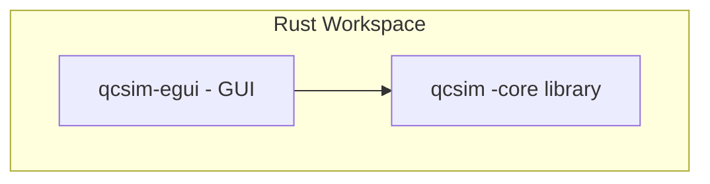
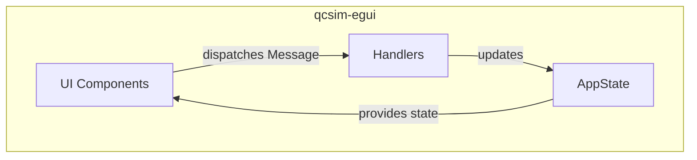

# Quantum Algorithm Simulator

[](https://benschneider.github.io/quantum_algorithm_simulator/)
[](COPYRIGHT.md)


[](https://www.conventionalcommits.org/en/v1.0.0/)

> **Note:** This repository currently hosts the **web demo** and **documentation**. The full Rust sources will be published here once they are ready for release.

<!-- CI badge (enable after adding .github/workflows/ci.yml):
[](https://github.com/benschneider/quantum_algorithm_simulator/actions)
-->

## Quick Links
- ▶️ **Live demo**: https://benschneider.github.io/quantum_algorithm_simulator/
- 📄 **License**: [Apache-2.0](LICENSE)
- 🧭 **Roadmap & tutorials**: see the in-app **Tutorial** (Help → Tutorial)


# Introduction to `qcsim`

`qcsim` is a quantum circuit simulator designed for both learning and research. It provides a robust backend for simulating quantum circuits and a user-friendly graphical interface for building, simulating, and visualizing quantum computations. This document serves as a comprehensive introduction to `qcsim`, covering its architecture, core concepts, and how to effectively use the application.

## Table of Contents

*   [Introduction to `qcsim`](#introduction-to-qcsim)
*   [High-Level Architecture](#high-level-architecture)
    *   [Project Structure](#project-structure)
    *   [Core Library: `qcsim`](#core-library-qcsim)
        *   [Key Components](#key-components)
        *   [Design Principles](#design-principles)
    *   [GUI Application: `qcsim-egui`](#gui-application-qcsim-egui)
        *   [Key Components](#key-components-1)
        *   [Unidirectional Data Flow](#unidirectional-data-flow)
    *   [Core UI Components](#core-ui-components)
    *   [Application Layout](#application-layout)
    *   [User Interaction Flow](#user-interaction-flow)
*   [Core Concepts](#core-concepts)
    *   [Dual-Component Architecture](#dual-component-architecture)
    *   [Model-View-Update (MVU) Architectural Pattern](#model-view-update-mvu-architectural-pattern)
    *   [Centralized and Modular State Management](#centralized-and-modular-state-management)
    *   [Key Features and Capabilities](#key-features-and-capabilities)
*   [How to Use `qcsim`](#how-to-use-qcsim)
    *   [Defining a Quantum Circuit](#defining-a-quantum-circuit)
        *   [Method 1: Using the Gate Palette and Circuit Grid](#method-1-using-the-gate-palette-and-circuit-grid)
        *   [Method 2: Using the JSON Editor](#method-2-using-the-json-editor)
        *   [Example: Bell State Circuit (from Template)](#example-bell-state-circuit-from-template)
    *   [Simulating a Quantum Circuit](#simulating-a-quantum-circuit)
        *   [Results View](#results-view)
        *   [Time Scrubber](#time-scrubber)
    *   [Loading and Saving Circuits](#loading-and-saving-circuits)
        *   [Available Templates](#available-templates)
    *   [Initial State Setup and Gate Editor](#initial-state-setup-and-gate-editor)
        *   [Initial State Editor](#initial-state-editor)
        *   [Gate Editor with Bloch Spheres](#gate-editor-with-bloch-spheres)
    *   [Supported Gates and Information Panels](#supported-gates-and-information-panels)
    *   [In-App Tutorials](#in-app-tutorials)
*   [Potential Future Directions](#potential-future-directions)


---

## High-Level Architecture

This section provides a high-level overview of the `qcsim` project's architecture. It is intended for new developers to quickly understand the project's structure, components, and design principles.

### Project Structure

`qcsim` is a Rust workspace composed of two main crates:

*   **`qcsim`**: A pure Rust library that provides the core quantum circuit simulation engine. It has no dependencies on UI frameworks, making it portable and reusable.
*   **`crates/qcsim-egui`**: A native GUI application built with the `egui` framework. It provides a user-friendly interface for building and simulating quantum circuits.

This separation of concerns allows the simulation engine to be developed and tested independently of the user interface.



### Core Library: `qcsim`

The `qcsim` library is the heart of the project. It is responsible for representing and simulating quantum circuits. Its architecture is designed to be modular and extensible.

#### Key Components

*   **`src/core/circuit.rs`**: Defines the quantum circuit data structure, which represents the sequence of quantum gates to be applied.
*   **`src/core/engine.rs`**: Implements the simulation engine that applies the gates to the quantum state.
*   **`src/core/gates.rs`**: Defines the various quantum gates that can be used in a circuit.
*   **`src/core/types.rs`**: Contains the fundamental data types used throughout the simulation, such as the representation of quantum states.

#### Design Principles

*   **Pure Rust Core**: The simulation engine is implemented in pure Rust with no dependencies on UI frameworks, making it portable and easy to integrate into other projects.
*   **Programmatic Gate Definitions**: All standard quantum gates are defined programmatically within the `GateRegistry`. This ensures that the core gates are always available and correctly implemented without relying on external files.
*   **Extensible Gate Model**: The `GateRegistry` supports multiple kinds of gates, making it easy to extend:
    *   **Unitary Gates**: Gates like H, X, and CNOT whose unitary matrices are defined as constants or generated by a function.
    *   **EigenGates**: A special trait for gates that can be raised to a power (e.g., `X^t`). This is used to implement rotational gates like `Rx`, `Ry`, and `Rz` efficiently and elegantly.
*   **Discrete Timestep Execution**: A quantum circuit is modeled as a sequence of timesteps, where each timestep contains a set of operations that are guaranteed by the validation logic to be on disjoint sets of qubits.
*   **Introspection API**: The simulation `run` method provides options to capture detailed, per-timestep snapshots of the full state vector and probabilities, not just the final result.
*   **Parallelism with Rayon**: The simulation engine uses the `rayon` crate to parallelize computationally intensive tasks:
    1.  **Gate Application**: The update of the state vector for each individual gate is parallelized.
    2.  **Measurement Sampling**: When running unseeded simulations with a large number of shots, the measurement outcomes are generated in parallel. (Seeded runs remain sequential to guarantee reproducibility).

### GUI Application: `qcsim-egui`

The `qcsim-egui` application provides a graphical user interface for interacting with the `qcsim` simulation engine. It is built using the `egui` framework and follows a Model-View-Update (MVU) architectural pattern.

#### Key Components

*   **`AppState` (`crates/qcsim-egui/src/state/app_state.rs`)**: This struct is the single source of truth for the application's state. It contains all the data needed to render the UI, including the current circuit, simulation results, and UI-specific state.
*   **`Message` (`crates/qcsim-egui/src/messages.rs`)**: This enum defines all the possible actions a user can take in the application. When a user interacts with the UI, a `Message` is dispatched.
*   **Handlers (`crates/qcsim-egui/src/handlers/`)**: The `handlers` module contains the business logic of the application. It receives `Message`s and updates the `AppState` accordingly.
*   **UI Components (`crates/qcsim-egui/src/components/` and `crates/qcsim-egui/src/ui/`)**: The UI is built from a set of reusable components. These components are responsible for rendering the UI based on the `AppState` and dispatching `Message`s in response to user input.

### Unidirectional Data Flow

The `qcsim-egui` application follows a unidirectional data flow, which makes the application's logic easy to understand and debug.



This architecture ensures that all state changes are centralized and predictable, which is crucial for building a robust and maintainable application.

### Core UI Components

The application is composed of several distinct, interactive panels, each serving a specific pedagogical purpose. The rendering logic for each component is encapsulated within the `components` module.

*   **Gate Palette (`components::gate_palette`)**:
    *   **Purpose**: Allows users to select quantum gates to place on the circuit.
    *   **Interaction**: Gates are organized into categories. Clicking a gate selects it for placement.

*   **Circuit Grid (`components::circuit_grid`)**:
    *   **Purpose**: The main interactive area where users build a quantum circuit.
    *   **Layout**: A grid where rows represent qubits and columns represent discrete time steps.
    *   **Interaction**:
        *   Clicking an empty grid cell places the currently selected gate.
        *   Clicking a gate opens the gate editor.
        *   Right-clicking a gate removes it.

*   **Results Panel (`components::results_panel`)**:
    *   **Purpose**: Displays the results of the quantum simulation.
    *   **Contents**:
        *   **Probabilities**: Shows the probability of measuring each qubit in the |0⟩ or |1⟩ state.
        *   **Raw State Vector**: Displays the raw complex amplitudes of the state vector.

*   **Top Panel (`ui::top_panel`)**:
    *   **Purpose**: Provides application-level controls.
    *   **Interaction**:
        *   A "File" menu for loading and saving circuits.
        *   A "Run" button to trigger the simulation.
        *   Controls for changing the number of qubits and timesteps.

### Application Layout

The layout uses `egui`'s panel system to create a clear, organized workspace.

*   **Top Panel**: Contains the main menu bar and circuit controls.
*   **Left Panel**: Contains the `Gate Palette`.
*   **Central Panel**: The largest area, dedicated to the `Circuit Grid`.
*   **Right Panel**: Contains the `Results Panel`.

### User Interaction Flow

The primary user workflow is as follows:

1.  **Select a Gate**: The user clicks a gate in the **Gate Palette**.
2.  **Place the Gate**: The user clicks an empty slot in the **Circuit Grid**.
3.  **Run Simulation**: The user clicks the "Run ▶" button in the **Top Panel**.
4.  **View Results**: The user views the results in the **Results Panel**.

---

## Core Concepts

This section provides a summary of the core concepts and architectural principles of the `qcsim` project.

### Dual-Component Architecture

The `qcsim` project is built on a clear separation of concerns, divided into two primary components:

*   **`qcsim`**: The backend simulation engine, written in Rust. It contains all the fundamental logic for representing quantum circuits, defining quantum gates, and executing simulations. This component is designed to be completely independent of any user interface.
*   **`qcsim-egui`**: A graphical user interface (GUI) built using the `egui` library. It provides a user-friendly, interactive environment for building circuits, running simulations, and visualizing results. It acts as a frontend that consumes the `qcsim` library.

This modular design allows for flexibility, such as creating alternative interfaces (e.g., a command-line tool) or integrating the core simulator into other projects.

---

### Model-View-Update (MVU) Architectural Pattern

The `qcsim-egui` application is architected around the **Model-View-Update (MVU)** pattern, which ensures a predictable, unidirectional data flow.

*   **Model (State):** The entire state of the application is held in a central `AppState` struct. This struct acts as the single source of truth, containing everything from the circuit's structure to the UI's transient state (e.g., which tab is open).
*   **View (UI Components):** The UI is composed of various components (e.g., the circuit grid, the gate palette) that are responsible for rendering the current `AppState`. They do not modify the state directly.
*   **Update (Message Handling):** When a user interacts with the UI, a `Message` is generated. These messages are collected and processed in a central `handle_message` function, which is the *only* place where the `AppState` is allowed to be modified.

This pattern makes the application easier to debug and reason about, as state changes are explicit and centralized.

---

### Centralized and Modular State Management

The application's state is managed in a structured and centralized way:

*   **`AppState`:** The root of the state tree, aggregating all other state modules.
*   **Sub-states:** The `AppState` is composed of more specific state structs, each responsible for a different domain:
    *   `CircuitState`: Manages the quantum circuit data (qubits, gates, etc.).
    *   `UIState`: Holds UI-specific data, like selected items or window visibility.
    *   `SimulationState`: Stores the results from the simulation engine.
    *   `InitialStateEditorState`: Manages the state for the custom initial state editor.

This modular approach keeps related data organized and prevents the main state object from becoming overly complex.

---

### Key Features and Capabilities

The `qcsim` simulator supports a rich set of features designed for flexibility and ease of use:

*   **User-Defined Gates:** Users can define their own custom 1-qubit and 2-qubit gates by providing a unitary matrix, extending the simulator's built-in gate set.
*   **State Persistence via JSON:** Circuits can be saved, loaded, and shared easily through a built-in JSON editor, which allows for direct viewing and modification of the circuit's data structure.
*   **Custom Initial State:** The simulator is not limited to the zero state. Users can define an arbitrary initial quantum state vector for their simulations.
*   **Interactive Visualizations:** Features like the Bloch sphere visualization provide immediate feedback on the effect of single-qubit gates.

---

## How to Use `qcsim`

This section provides a basic overview of how to define and simulate quantum circuits using the `qcsim` EGUI application.

> This app runs in your browser via **WebAssembly (WASM)**. Performance depends on your device and browser. For best results, use a recent Chromium- or Firefox-based browser on desktop.

### Defining a Quantum Circuit

Quantum circuits in `qcsim` are defined visually by selecting gates from a palette and clicking on the circuit grid, or by directly editing their JSON representation.

#### Method 1: Using the Gate Palette and Circuit Grid

1.  **Access the Gate Palette**: On the left-hand side of the application, you will find the "Gates" panel (Gate Palette) containing various quantum gates (e.g., Hadamard, Pauli-X, CNOT).
2.  **Select a Gate**: Click on a gate in the palette to select it. The selected gate will be highlighted.
3.  **Place the Gate**: Click on an empty cell in the central circuit grid to place the selected gate.
    *   Place gates on specific qubits and at desired time steps.
    *   For multi-qubit gates like CNOT, ensure you select the appropriate qubits after placing the gate.
    *   To deselect a gate, click on it again in the palette, or click on an empty area of the circuit grid.
    *   The circuit grid allows you to visually construct your quantum circuit step-by-step.


#### Method 2: Using the JSON Editor

For users familiar with the circuit JSON format, or for loading pre-defined circuits, you can use the integrated JSON editor:

1.  **Switch to JSON View**: In the central panel, select the "JSON" tab.
2.  **Edit JSON**: You can directly type or paste your circuit definition in JSON format here.
3.  **Update Circuit**: After editing, the visual circuit grid will update to reflect your JSON changes. Conversely, changes in the visual editor will update the JSON.

#### Example: Bell State Circuit (from Template)

The Bell state is a fundamental entangled state. You can load this circuit from the templates. Here's the JSON representation:

```json
{
  "num_qubits": 2,
  "initial_preps": [null, null],
  "steps": [
    [
      {
        "id": "H",
        "qubits": [0]
      }
    ],
    [
      {
        "id": "CX",
        "qubits": [0, 1]
      }
    ]
  ]
}
```

This JSON defines a 2-qubit circuit. The first step applies a Hadamard gate to qubit 0. The second step applies a Controlled-NOT gate with qubit 0 as the control and qubit 1 as the target.


### Simulating a Quantum Circuit

Once your circuit is defined, you can simulate it within the `qcsim` EGUI:

1.  **Run Simulation**: Click the "Run ▶" button, typically located in the circuit controls section above the circuit grid.
2.  **View Results**: After the simulation completes, a "Results" window will pop up (or become visible).

#### Results View

The "Results" window displays the outcome of your simulation:

*   **Raw State Vector**: Shows the amplitudes of non-zero basis states. For large numbers of qubits, this is presented in a sparse, paginated format.
*   **Probabilities**: A bar chart visualizing the measurement probabilities for each basis state.


#### Time Scrubber

The "Timestep" slider, located near the "Run" button, allows you to scrub through the simulation steps, observing the state of the qubits at each point in the circuit. This is useful for understanding the evolution of the quantum state.


### Loading and Saving Circuits

`qcsim` allows you to load existing circuit JSON files, save your current circuit, and load predefined templates:

1.  **File Menu**: Access the "File" menu in the top-left corner of the application.
2.  **Load Circuit**: Select "Load" to open a JSON circuit file from your system.
3.  **Save Circuit**: Select "Save" to save your current circuit to a JSON file.
4.  **Load Template**: Under the "File" menu, you can also select "Load Template" to load from a list of predefined example circuits.

#### Available Templates

The `qcsim` application comes with several pre-built circuit templates:

*   **Bell**: Creates an entangled Bell state.
*   **Bell Test Complex**: A more elaborate Bell state test.
*   **Deutsch Algorithm**: Implements the Deutsch algorithm.
*   **Deutsch Jozsa**: Implements the Deutsch-Jozsa algorithm.
*   **GHZ**: Creates a Greenberger–Horne–Zeilinger (GHZ) state.
*   **Grover**: Implements Grover's search algorithm (basic).
*   **Grover Algorithm**: A more complete implementation of Grover's search.
*   **QFT**: Implements the Quantum Fourier Transform.
*   **QFT4**: A 4-qubit Quantum Fourier Transform.
*   **Quantum Teleportation**: Demonstrates the quantum teleportation protocol.

### Initial State Setup and Gate Editor

#### Initial State Editor

You can set a custom initial state for your qubits:

1.  **Access Editor**: Go to the "Settings" menu and select "Set Initial State...".
332 | 2.  **Define Amplitudes**: In the "Set Initial State" window, you can enter the real and imaginary amplitudes for each basis state.
333 | 3.  **Apply/Reset**: Use the "Apply" button to set the new initial state or "Reset to |0>" to revert to the default all-zero state.

#### Gate Editor with Bloch Spheres

You can view and edit custom gate definitions, and visualize the effect of single-qubit gates on a Bloch Sphere:

1.  **Access Editor**: From the "View" menu, select "Gate Editor".
2.  **Bloch Sphere Visualization**: For single-qubit gates, the Bloch Sphere will dynamically update to show the transformation of a qubit's state.

### Supported Gates and Information Panels

`qcsim` supports a variety of common quantum gates.

*   **Gate Reference**: For a complete list of supported gates and their parameters, navigate to the "Help" menu, select "Info", and then choose the "Gate Reference" tab.
*   **About Panel**: The "About" tab in the "Help" menu provides application details.

### In-App Tutorials

`qcsim` includes a series of interactive tutorials embedded directly within the application to guide you through various quantum computing concepts and `qcsim` features.

1.  **Access Tutorials**: From the "Help" menu, select "Tutorial".

---

## Potential Future Directions

Based on initial concepts and roadmap documents, `qcsim` has potential for future evolution in several areas:

### Gamification and Educational Enhancement
*   **Structured Tutorial Campaigns:** Guided learning paths with immediate feedback, covering quantum fundamentals to advanced algorithms.
*   **Sandbox Mode:** Open experimentation environment with features like circuit sharing and community integration.
*   **Competition Mode:** Algorithmic challenges with resource constraints.
*   **Code Mode:** Implementation of a quantum assembly language with bi-directional synchronization to the visual circuit builder.

### Advanced Quantum State Visualization
*   **Multi-Level Bloch Sphere Visualization:** More sophisticated 3D rendering and dynamic updates.
*   **Complex Amplitude and Phase Plots:** Visualizations showing complex amplitudes and phases of multi-qubit states.
*   **Full Density Matrix Visualization:** Expert-level visualization for in-depth state analysis.

### Real-world Simulation Aspects
*   **Noise Models:** Introduction of realistic noise models to simulate imperfections in quantum computers.

---

## License

Licensed under either of

- Apache License, Version 2.0 ([LICENSE-APACHE](LICENSE-APACHE) or https://www.apache.org/licenses/LICENSE-2.0)
- MIT license ([LICENSE-MIT](LICENSE-MIT) or https://opensource.org/licenses/MIT)

at your option.

### Contribution

Unless you explicitly state otherwise, any contribution intentionally submitted
for inclusion in the work by you, as defined in the Apache-2.0 license, shall be
dual licensed as above, without any additional terms or conditions.